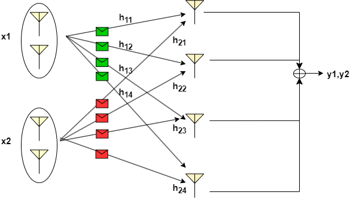
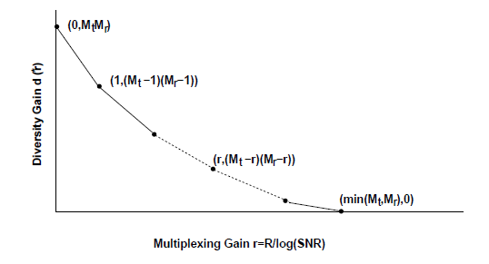

In the previous two experiments, we have learned about spatial diversity and multiplexing techniques separately. It is understood that the diversity improves the received SNR which helps to reduce the bit error rate (BER), whereas the spatial multiplexing enables the transmission of parallel data streams so that the transmission capacity can be improved.

In multiplexing, we decompose the MIMO  channel into parallel SISO channels. The SNRs associated with these parallel streams depend on the eigenvalues of channel covariance matrix. Thus, there is a possibility that the SNR of a particular stream is poor which may result in its poor BER performance. To overcome this, the spatial degree of freedom offered by the channel can be partially used for diversity gain with some reduction in the multiplexing gain. This will improve SNR performance at the cost of the reduced number of parallel streams, which essentially leads to "diversity vs. multiplexing trade-off". The choice of diversity and multiplexing orders will depend on the application. For instance, a higher multiplexing order will provide a high transmission rate but with poor BER performance.   Whereas, setting a high diversity order will improve BER performance but at the cost of reduced data rate. Therefore, such diversity vs. multiplexing trade-off can be also viewed as the trade-off between transmission rate and BER.

Consider the scenario illustrtated in the following figure, where the transmitter has 4 transmit antennas and the reciever has 4 receive antennas. If the multiplexing gain of 2 is desired, then antennas can be divided into 2 groups so that each group stream can utilize 2 antennas for the diversity as shown in the figure.

For a given multiplexing gain $m$, then the optimal diversity gain that can be achieved is given as

$$ d = (N_t - m)(N_r - m) $$.

The optimal multiplexing and diversity trade-off can be visualized from the following plot [2].

